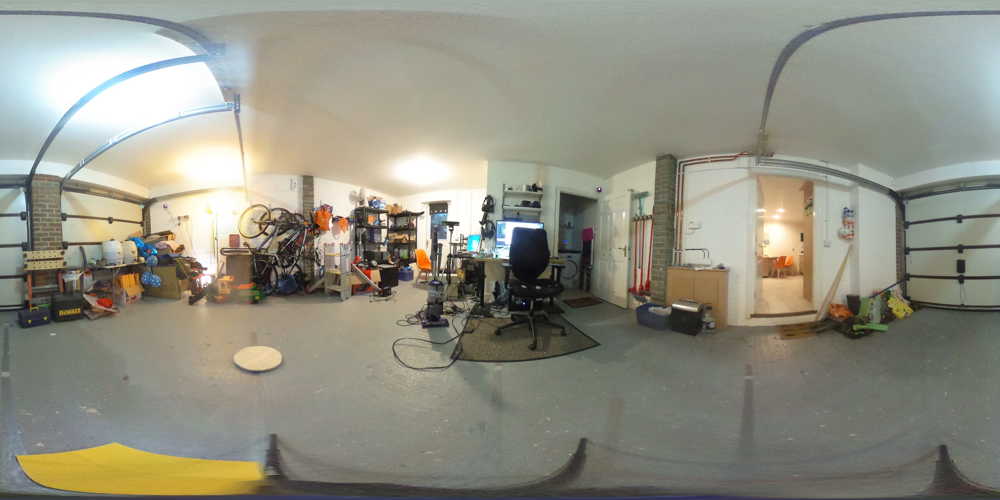

A fun week this week! Not much implementation, lots of talking.
I caught up with some friends down
at Develop in Brighton on Thursday, including a quick visit to
the Boss Alien Mothership. Lots of great things happening there,
and lots of interesting conversations with folks about what I've been
up to and where they think it could go.

I've got my first "out of my house" scan completed now, for adding into
the holodeck, and I'll be doing the first tests over t'internet with
an external participant, hopefully next week.

I've also grabbed a set of 360 photos of the garage, and I'm going to
try using them as the basis for a lightfield data set. This stuff could
be awesome, but I've got a lot of learning to do before It'll be working.
The resolution of the images is pretty decent (5.3K by 2.7K) but it's
very noticably pixelated/blurred when an image is viewed as a full sphere
in VR. Until I get the blending across the data set working, I'll not know
if it looks better than an environment scan - at least the lighting/reflection
looks decent, and black surfaces are present.

The capture process is very manual at the minute, which means I've got a selection of
27 photospheres at 10cm intervals in each axis (a 3x3 cube) - but the measurements
of the offsets is pretty vague, and the rotation of the camera changed as I moved
the tripod around the room. I've spent a chunk of time manually aligning them as
best I can, but I'm fairly sure the delta in the offsets means the data set is going
to be a bit rubbish.

In theory, it should be possible to do panogrammetry on these images, but that's
another big chunk of math I'll need to learn. I think that would allow for
interpolating across the image dataset rather than blending, as you could convert
the 360 sphere into a mesh and then raycast against that for the relevant pixel
colour. It should also allow for correcting the positional/rotational offsets in
the images - something to think about trying, at least.

I've hopefully got a collaborator ready to do some kinect feed tests with me, and
if I'm lucky we can push forward on getting some realtime processing of the feeds
into a textured mesh for dispatch over the network. [I saw a wonderful video this
week of realtime meshing from multiple depth/colour feeds](https://www.youtube.com/watch?v=2dkcJ1YhYw4)
 - not quite up to the
level of quality of the microsoft multi-camera scans, but still much better than
my currently scanned avatar meshes.

More info (and details) on how I'm approaching the lightfields next week.

