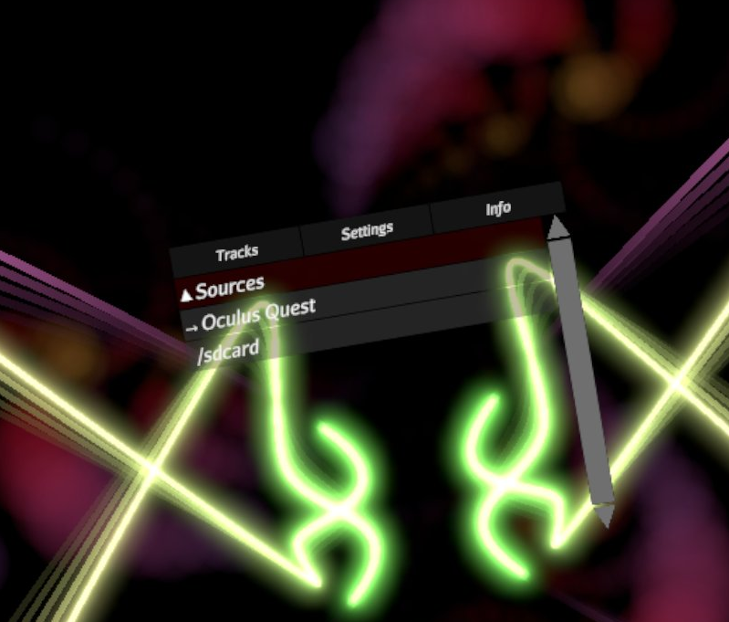
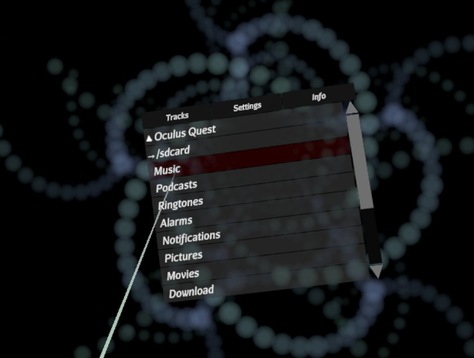
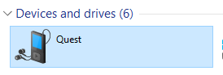
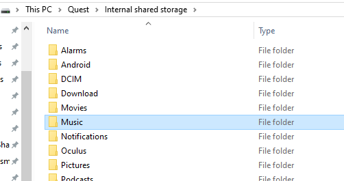
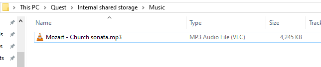

[(back to Evryway Visualiser)](index)

# [How to download](#how-to-download)

[Evryway Visualiser is currently available via Itch.io.](https://evryway.itch.io/evryway-visualiser)

# [How to install](#how-to-install)

### Via SideQuest

Ensure you've got the latest version of [SideQuest](https://sidequestvr.com/#/) installed.

Download the APK, browse to it in Windows Explorer, and drag it on to the SideQuest window.

{:height="50%" width="50%"}

### Via ADB

You'll need [ADB installed](https://www.howtogeek.com/125769/how-to-install-and-use-abd-the-android-debug-bridge-utility/)
and on your path.

Open up a command prompt in windows. 

Check ADB is recognising your device by typing

'''
    adb devices
'''

if nothing appears, check your Quest is connected via a USB cable. Make sure you've only got one device connected.

Once your Quest is connected, use ADB to install Evryway Visualiser:

'''
adb install -r path_to_your_downloads/com.Evryway.EvrywayVisualiser_Release.apk
'''

# [How to visualise](#how-to-visualise)

As of Nov, 2019, Visualiser will begin playing a demo song.

Press the MENU button on the left controller to bring up the menu at any point.

use the LEFT STICK to skip the current track forwards and backwards.

use the RIGHT STICK to skip to previous and next track.

use the RIGHT GRIP to recentre your view.

from the MENU,

Select TRACKS for a list of music tracks. 
* Browse sources by highlighting them with the pointer and clicking with the trigger.
* You can use the joystick to scroll (just point away from the menu).

Select SETTINGS for application settings.

Select INFO to find out additional details about the app.

If you keep your hands still for a while, they'll fade away. Move them to bring them back.

# [How to play a music track](#how-to-play-music)

Once a track is on your Quest, you can select it from the Tracks menu.

Press the Menu button, and click on Tracks.

If you have MP3s on your Quest, you'll find them under Sources, Oculus Quest.

then browse to /sdcard, and down to the correct location.
{:height="50%" width="50%"}

{:height="50%" width="50%"}
{:height="50%" width="50%"}

Then, select the track (point and click)

{:height="50%" width="50%"}

Now, Your track should start playing!

{:height="50%" width="50%"}

If you have a DLNA server, it should show up under Sources - select it, and browse
to the right track.

# [How to add music to your Quest](#how-to-add-music)

There's a few ways to get music tracks on to your quest. You'll need to start with one or more
MP3s on your PC.

The simplest way is to copy the files over using Windows Explorer.

## Copying files with Windows Explorer

Browse to the Quest device on your PC. 

NOTE: If you don't see the Quest device, you can normally make it appear by running "adb devices" from the commandline.

From there, find a place to put your music. You can copy tracks anywhere you want - let's put them in the Music
folder to start with. You can create your own folders, and copy over folders too.

Then, copy over the track from your PC. Drag'n'drop, cut-n-paste, the choice is yours.

## Copying files with SideQuest

If you can't get your quest visible on the PC for some reason, never fear - you can use SideQuest to copy tracks
over. Select "File Explorer" in SideQuest, browse to your destination, and click the "Add something" (+) button in
the bottom right, then "copy file to this folder". Pick your file, and wait for SideQuest to copy it over.

