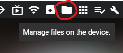

[(Back to instructions)](index)

# [How to add music to your Quest](#how-to-add-music)

There's a few ways to get music tracks on to your quest. You'll need to start with one or more
MP3s on your PC.

## Copying files with SideQuest

The easiest way is to use the latest version of SideQuest and drag files over to your device.

Make sure your quest is connected in Sidequest, then select the "Manage Files on the device" button.

Next, select the destination where you'd like to put your MP3 tracks (or folders, if you're copying over
multiple tracks at once). We recommend somewhere under the /sdcard/Music folder, but you can put them
wherever you want.

Finally, drag the files or folders from Windows Explorer onto your device. 

## Copying files with Windows Explorer

Alternatively, you can Browse to the Quest device on your PC. 

NOTE: If you don't see the Quest device, you can normally make it appear by running "adb devices" from the commandline.

From there, find a place to put your music. We recommender the Music folder, but you can copy tracks anywhere you want.
You can create your own folders, and copy over folders too.

Then, copy over the track from your PC. Drag'n'drop, cut-n-paste, the choice is yours.

---
[(Back to instructions)](index)

