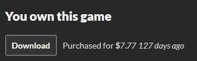
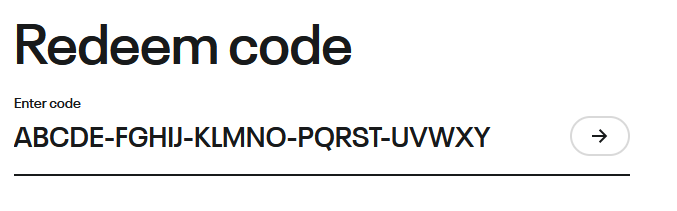
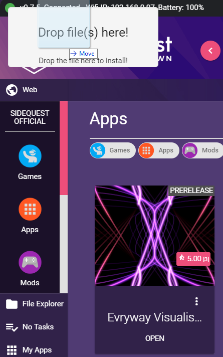
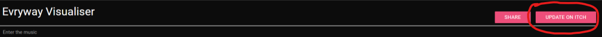
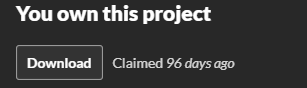
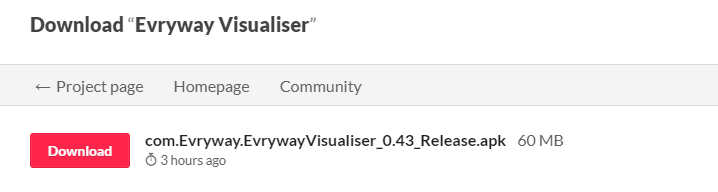

[(Back to instructions)](index)

# [How to purchase](#how-to-download)

[Evryway Visualiser is currently available via Itch.io.](https://evryway.itch.io/evryway-visualiser)

<iframe src="https://itch.io/embed/507905?bg_color=000000&amp;fg_color=f3fde7&amp;link_color=fa5c5c&amp;border_color=333333" width="552" height="167" frameborder="0">
<a href="https://evryway.itch.io/evryway-visualiser">Evryway Visualiser by Evryway</a>
</iframe>

And now - Evryway Visualiser is available on Oculus App Lab Too!

# [How to install](#how-to-install)

## [Install thru Oculus App Lab](#install-applab)

If you have purchased directly from the Oculus store, you should already have the app on your device. Congratulations,
and thanks for your purchase!

## [Install thru Itch.io](#install-itch)

Your Itch purchase will come with an Oculus App Lab Key. This is the simplest way to install the app.

Go to the Itch.io site, and browse to the "Download" link for Visualiser.

{:height="50%" width="50%"}

Click the "Get Oculus Key" button

{:height="50%" width="50%"}

take a copy of the 25-letter key that appears.

Next, go visit the [Oculus Redeem Code page](https://secure.oculus.com/redeem-code/), and enter the key.

{:height="50%" width="50%"}

You should now have the app installed via App Lab.

## [Install the APK from Itch using SideQuest](#install-sq)

Ensure you've got the latest version of [SideQuest](https://sidequestvr.com/#/) installed.

If you have already downloaded the APK from Itch.io, you can manually install it via Sidequest.

browse to the APK in Windows Explorer, and drag it on to the SideQuest window.

{:height="50%" width="50%"}

If you don't have a local copy already, you can grab it while in Sidequest.

[Sidequest app link](https://sidequestvr.com/#/app/325)

If you have claimed your key on Itch, you can click the "Update On Itch" button in Sidequest.
If you're on the latest version you may see "Buy on Itch" or "View On Itch" instead.

Next, click "Download"

{:height="50%" width="50%"}

 then pick the latest release APK.
SideQuest will download and install it for you.

{:height="50%" width="50%"}

If you don't see the "Download" button on the Itch.io page, and you've already claimed a valid download key,
make sure you're logged in to Itch.Io while in Sidequest. You don't ever need to purchase more than once!

## Via ADB

You'll need [ADB installed](https://www.howtogeek.com/125769/how-to-install-and-use-abd-the-android-debug-bridge-utility/)
and on your path.

Open up a command prompt in windows. 

Check ADB is recognising your device by typing

'''
    adb devices
'''

if nothing appears, check your Quest is connected via a USB cable. Make sure you've only got one device connected.

Once your Quest is connected, use ADB to install Evryway Visualiser:

'''
adb install -r path_to_your_downloads/com.Evryway.EvrywayVisualiser_Release.apk
'''
---
[(Back to instructions)](index)

