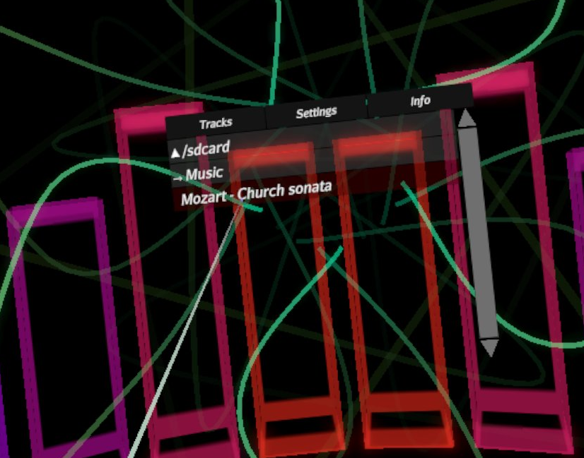
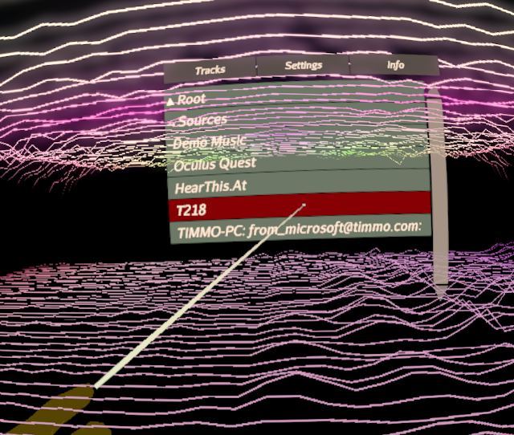

[(Back to instructions)](index)
# [How to play a music track](#how-to-play-music)

Once a track is on your Quest, you can select it from the Tracks menu.

If you're using controllers, Press the Menu button, and click on Tracks using the trigger.
If you're using hand tracking, make a thumbs-up with your left hand, wait for the
menu, then then click on Tracks using a pinch.

If you have MP3s on your Quest, you'll find them under Sources, Oculus Quest.

then browse to /sdcard, and down to the correct location.
{:height="50%" width="50%"}
{:height="50%" width="50%"}
{:height="50%" width="50%"}

Then, select the track (point and click)

{:height="50%" width="50%"}

Now, Your track should start playing!

{:height="50%" width="50%"}

# [DLNA Servers](#dnla-servers)

If you have a DLNA server, it should show up under Sources - select it, and browse
to the right track.

{:height="50%" width="50%"}

If you don't see your DLNA server listed, or your music won't play, please get in touch
and we'll do our best to make it work for you!

---
[(Back to instructions)](index)

